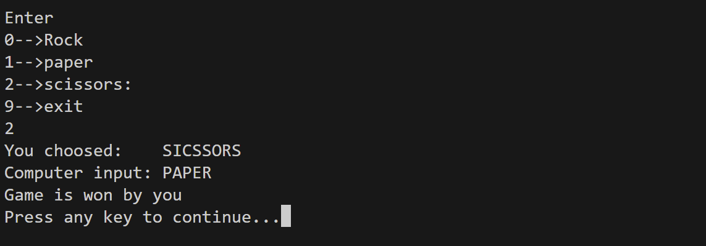

# Rock-Paper-Scissors-through-C

## Overview

This is a command-line implementation of the classic **Rock, Paper, Scissors** game in C. The game allows a user to play against the computer, with randomized computer choices and dynamic scoring.

## Features

- Cross-platform compatibility (Windows and Unix-based systems).
- Simple menu-driven gameplay.
- Keeps track of the user's and the computer's scores.
- Dynamic input handling using `getch()` or a platform-specific implementation.

## How to Play

1. Run the program from a terminal or command prompt.
2. Enter:
   - `0` for **Rock**.
   - `1` for **Paper**.
   - `2` for **Scissors**.
   - `9` to exit the game.
3. View the result of each round, including your choice and the computer's choice.
4. At the end of the game, see your final score compared to the computer's.

## How to Compile and Run

1. Open a terminal or command prompt.
2. Compile the code using GCC or any other C compiler:
   ```bash
   gcc rock_paper_scissors.c -o rock_paper_scissors
   ```
3. Run the program:
   ```bash
   ./rock_paper_scissors
   ```

### Notes for Unix-based Systems (Linux/macOS)
- The program uses a custom implementation of `getch()` via the `termios.h` library for character input.
- Ensure that your system supports `termios.h`.

## Example Gameplay



**Randomized Computer Choice**:
  The computer's choice is generated using:
  ```c
  srand(time(0));
  com_in = rand() % 3;
  ```

**Error Handling**:
  Invalid input is handled with descriptive error messages:
  ```c
  fprintf(stderr, "An error occurred: %s\n", "Invalid input");
  ```

## Improvements can be done

- Add a graphical interface or web version.
- Implement additional features like streak tracking or advanced rules.